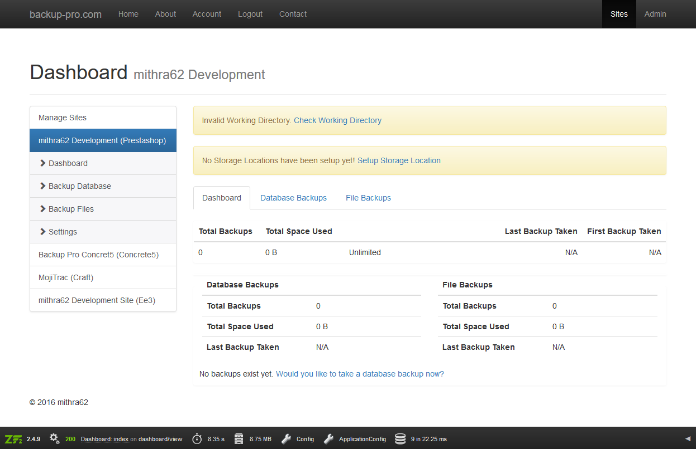

# Backup Pro Manager #

The Backup Pro Manager allows for remote control over multiple [Backup Pro](http://backup-pro.com/) installations all from a single location. So long as you're using Backup Pro >= 3.3, you're ready to use the Backup Pro Manager. 

## About ##

Backup Pro Manager is a completely stand alone system that installs as any other website or framework. Be sure to check out the [INSTALL](INSTALL.md) file to get started. 

Backup Pro Manager works by using the REST API included with Backup Pro 3.3 or greater so no details are stored or saved. 